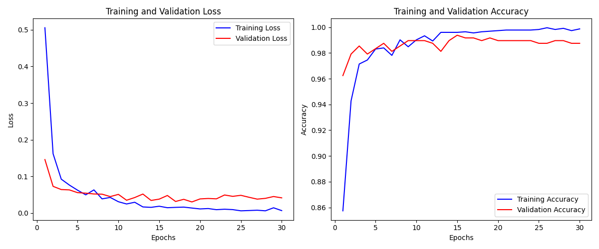
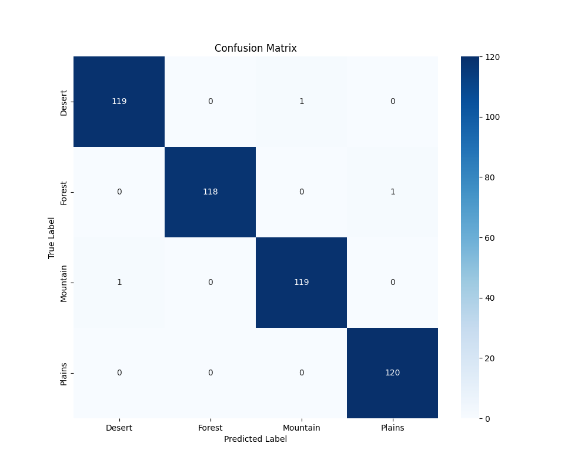

# Terrain Types Classification

## Overview
This project implements a deep learning solution for classifying terrain types from images. Using PyTorch and transfer learning with ResNet50, the model accurately identifies four distinct terrain categories: desert, forest, mountain, and plains.

## Dataset
The model is trained on the [Different Terrain Types Classification](https://www.kaggle.com/datasets/durgeshrao9993/different-terrain-types-classification) dataset from Kaggle, containing balanced samples of four terrain categories.

## Results

### Training and Validation Metrics


The training curves demonstrate:
- Rapid convergence within the first 5 epochs
- Final training accuracy of ~99.5%
- Final validation accuracy of ~98.7%
- Stable performance with minimal overfitting

### Confusion Matrix


The confusion matrix shows excellent classification performance:
- Desert: 119/120 correctly classified (99.2% accuracy)
- Forest: 118/119 correctly classified (99.2% accuracy)
- Mountain: 119/120 correctly classified (99.2% accuracy)
- Plains: 120/120 correctly classified (100% accuracy)

## Implementation Details

### Architecture
- Base model: ResNet50 (pretrained on ImageNet)
- Modified fully connected layer for 4-class classification
- Training with transfer learning approach

### Data Processing
- Image size: 224×224 pixels
- Data augmentation: random flips, rotations, and color jitters
- Train/validation/test split: 70%/15%/15%

### Training Setup
- Optimizer: SGD with momentum (0.9)
- Learning rate: 0.001 with ReduceLROnPlateau scheduling
- Loss function: Cross-Entropy Loss
- Batch size: 32
- Training epochs: 30 with early stopping

## Project Structure
terrain_classification/
├── data/
│   └── Different-Terrain-Types/
├── models/
│   └── saved_models/
├── utils/
│   ├── data_utils.py
│   └── visualization.py
├── config.py
├── train.py
└── evaluate.py

## Usage

### Setup
1. Clone the repository
2. Install dependencies:
   ```bash
   pip install torch torchvision scikit-learn matplotlib seaborn numpy tqdm pillow

Download the dataset from Kaggle

### Training and Evaluation
```bash
  python train.py
  python evaluate.py
